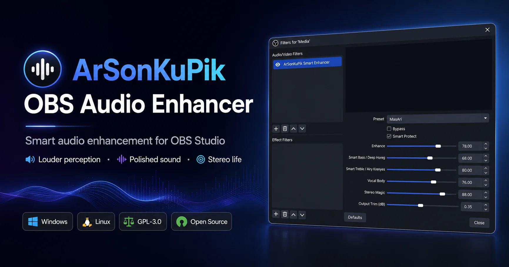
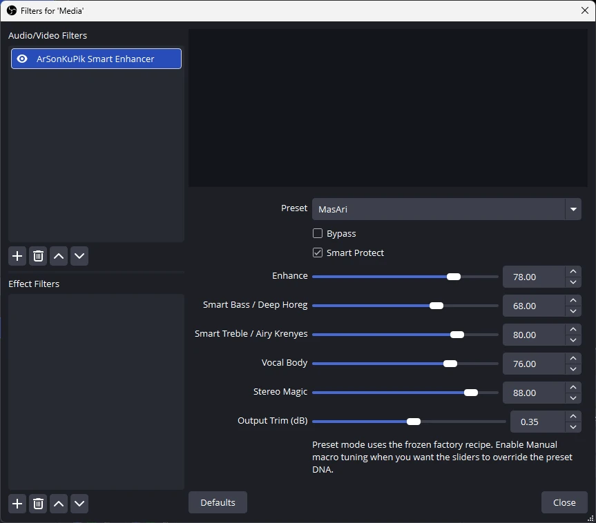

<p align="center">
  <a href="https://github.com/masarray/arsonkupik-obs-audio-enhancer">
    
  </a>
</p>

<h1 align="center">ArSonKuPik OBS Audio Enhancer</h1>

<p align="center">
  <a href="LICENSE"></a>
  <a href="https://github.com/masarray/arsonkupik-obs-audio-enhancer/actions/workflows/ci.yml"></a>
  <a href="https://github.com/masarray/arsonkupik-obs-audio-enhancer/actions/workflows/release.yml"></a>
  <a href="#downloads"></a>
  <a href="https://masarray.github.io/arsonkupik-obs-audio-enhancer/support.html"></a>
</p>

<p align="center">
  Professional smart audio enhancement filter for <strong>OBS Studio</strong>. Built for everyday playback, music, media, and spoken-word content that should feel louder in perception, more polished, more alive, and more enjoyable without impractical real-time CPU cost.
</p>

<p align="center">
  <a href="https://github.com/masarray/arsonkupik-obs-audio-enhancer/releases"><strong>Download latest release</strong></a>
  ·
  <a href="https://masarray.github.io/arsonkupik-obs-audio-enhancer/">Product site</a>
  ·
  <a href="https://masarray.github.io/arsonkupik-obs-audio-enhancer/support.html">Support development</a>
  ·
  <a href="docs/BUILD_WINDOWS.md">Build guide</a>
  ·
  <a href="docs/releases/">Release notes</a>
</p>

> Goal: when the filter is ON, users should hear a meaningful benefit in loudness perception, clarity, stereo life, and listening enjoyment.

## Screenshot



## Highlights

- Smart loudness benefit tuned across moderate and hot input-level test cases
- Musical presets for music, media, podcast, and night listening
- OBS-native audio filter workflow
- Stereo integrity-first enhancement designed to preserve center focus
- Shared, regression-tested preset and bypass transition processor
- Selective subsystem retuning so unrelated DSP sections are not rebuilt unnecessarily
- Settled hard-bypass path with exact pass-through audio and reduced bypass CPU work
- Automated releases with pinned OBS dependency, installer, portable ZIP, Linux package, metadata, and SHA-256 checksums

## Public quality targets

ArSonKuPik is designed and regression-tested against explicit real-time audio goals:

- click-safe continuous control movement without resetting filter history;
- click-safe preset and bypass transitions through a shared tested transition processor;
- stable dynamics without obvious full-band pumping or breathing;
- calibrated Filter ON benefit at moderate source levels while allowing safe behavior on hot mastered sources;
- practical CPU behavior that stops retuning after parameters settle and skips the creative chain during settled bypass;
- audible Smart Bass, Smart Treble, Vocal Body, and Stereo Magic ranges;
- stable center focus and useful mono compatibility.

These are engineering targets and regression gates, not an absolute guarantee for every host, driver, device, or source. See [Audio quality standards](docs/AUDIO_QUALITY.md) for validation methods, implementation rules, listening protocol, and release gates.

## Channel policy

ArSonKuPik is currently a **stereo/front-left and front-right processor**. On multichannel OBS sources, channels after the front L/R pair are passed through unchanged. This avoids applying unlinked dynamics or unequal gain to center, LFE, and surround channels before a dedicated linked multichannel design has been implemented and validated.

## Support development

ArSonKuPik remains free, complete, and open source under GPL-3.0. Voluntary support helps fund Windows and Linux validation, OBS compatibility work, release engineering, audio-quality regression testing, documentation, and continued public development.

Official support entry point:

- **Global:** GitHub Sponsors for one-time or recurring support
- **Indonesia:** verified merchant QRIS after the official QR image and recipient name are validated
- **Funding policy:** no paid feature unlocks, no sponsor-controlled roadmap, and no guaranteed deliverables
- **Recognition:** optional and opt-in through [`SUPPORTERS.md`](SUPPORTERS.md)

Use only the official support page:

**https://masarray.github.io/arsonkupik-obs-audio-enhancer/support.html**

Do not trust payment links, account numbers, or QR images shared elsewhere unless the same destination is published on that page. See [Funding policy](docs/FUNDING_POLICY.md).

## Quality, support, and contribution

- [Audio quality standards](docs/AUDIO_QUALITY.md) — DSP targets, gain-staging policy, transition validation, CPU expectations, stereo tests, and release gates
- [Support guide](SUPPORT.md) — installation, build, diagnostic, and audio-report requirements
- [Contributing guide](CONTRIBUTING.md) — contributor workflow, real-time audio-thread rules, test requirements, and pull-request checklist
- [Security policy](SECURITY.md) — supported versions, private vulnerability reporting, coordinated disclosure, and release-safety guidance
- [Funding policy](docs/FUNDING_POLICY.md) — official channels, use of funds, supporter recognition, independence, privacy, and payment security

## Downloads

Use the latest GitHub Release:

- **Windows installer `.exe`** — recommended for most users
- **Windows portable `.zip`** — manual copy/paste install
- **Linux `.tar.gz`** — manual Linux package artifact
- **`SHA256SUMS.txt`** — integrity hashes for all published assets
- **`BUILD-METADATA.txt`** — source commit and pinned OBS build dependency

GitHub Releases: https://github.com/masarray/arsonkupik-obs-audio-enhancer/releases

## Install

### Windows installer

1. Close OBS Studio.
2. Download `ArSonKuPik-OBS-Audio-Enhancer-Setup-vX.Y.Z.exe`.
3. Optionally verify its SHA-256 hash against `SHA256SUMS.txt`.
4. Run the installer as Administrator.
5. Restart OBS Studio.
6. Add the filter from **Audio Source → Filters → + → ArSonKuPik Smart Enhancer**.

The installer uses the standard OBS ProgramData plugin location:

```text
C:\ProgramData\obs-studio\plugins\arsonkupik-obs-audio-enhancer
```

### Windows portable ZIP

1. Close OBS Studio.
2. Extract the ZIP.
3. Copy the `arsonkupik-obs-audio-enhancer` folder into:

```text
C:\ProgramData\obs-studio\plugins\
```

4. Restart OBS.

### Linux

Extract the Linux `.tar.gz` release asset and copy the package contents into the appropriate OBS plugin path for your distribution/package style.

## Local Windows build

Only two root `.bat` files are kept intentionally:

```text
build_plugin_single_click.bat
install_plugin_windows.bat
```

`build_plugin_single_click.bat` builds the OBS plugin and creates a ProgramData-ready package.  
`install_plugin_windows.bat` installs that local package into the standard OBS ProgramData plugin folder.

The build helper uses `scripts/find-cmake.bat` internally to find CMake, including Visual Studio bundled CMake. Official and default local builds use the OBS Studio version pinned in `cmake/OBS_VERSION.txt`.

## Release automation

Create and push a matching semantic-version tag to trigger the release workflow. Before packaging, the workflow verifies tag/version consistency and runs the loudness, realtime, and transition hardening gates. It then publishes:

- Windows installer `.exe`
- Windows portable `.zip`
- Linux `.tar.gz`
- `BUILD-METADATA.txt`
- `SHA256SUMS.txt`
- public, user-facing release notes

```bash
git tag -a vX.Y.Z -m "ArSonKuPik OBS Audio Enhancer vX.Y.Z"
git push origin vX.Y.Z
```

See [docs/RELEASE_AUTOMATION.md](docs/RELEASE_AUTOMATION.md).

## Repository structure

```text
.github/            GitHub Actions workflows, templates, and funding entry point
assets/             README and branding assets
cmake/              pinned build dependency metadata
data/               OBS plugin data and locale files
docs/               public docs, policies, release notes, and landing page
include/            DSP headers
packaging/windows/  Inno Setup installer script
scripts/            build/package scripts
src/                plugin + DSP source
tests/              loudness, realtime, and transition regression tests
```

## License

Licensed under the **GNU General Public License v3.0**. See [LICENSE](LICENSE).

ArSonKuPik is an independent open-source project and is not affiliated with or endorsed by OBS Project. OBS and OBS Studio are names/trademarks of their respective owners.
