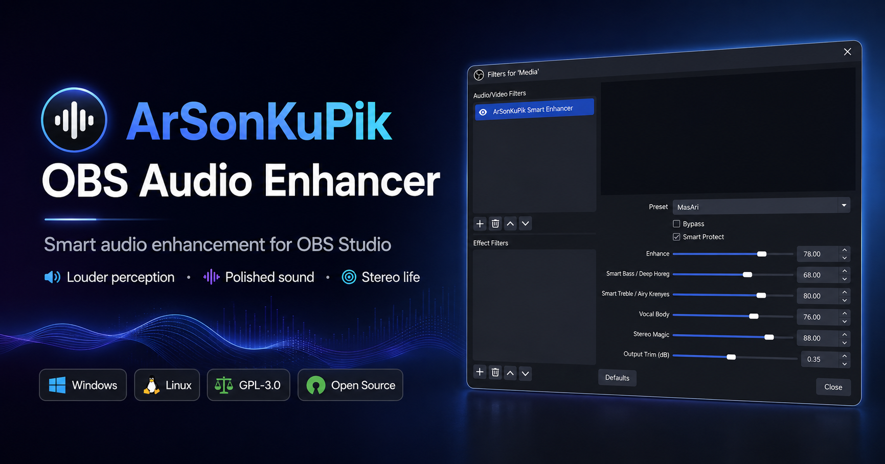

<p align="center">
  
</p>

<h1 align="center">ArSonKuPik OBS Audio Enhancer</h1>

<p align="center">
  <a href="LICENSE"></a>
  <a href="https://github.com/masarray/arsonkupik-obs-audio-enhancer/actions/workflows/ci.yml"></a>
  <a href="https://github.com/masarray/arsonkupik-obs-audio-enhancer/actions/workflows/release.yml"></a>
  
</p>

<p align="center">
  Smart audio enhancement for <strong>OBS Studio</strong> — designed to make music, media playback, and spoken audio sound <strong>louder in perception</strong>, <strong>more polished</strong>, and <strong>more enjoyable</strong> in real-world listening.
</p>

## Why ArSonKuPik?

Most OBS audio workflows focus on technical control. ArSonKuPik focuses on the listener experience.

When the filter is enabled, users should hear a clear benefit:

- **Louder perception** without relying on harsh distortion
- **Polished sound** with smarter enhancement and safer gain staging
- **Stereo life** that feels wider and more alive without collapsing the center
- **Simple workflow** built for real OBS use, not overcomplicated studio routing

## Screenshot


## Key features

- **Native OBS audio filter** with a clean, direct UI
- **Preset-driven enhancement** for music, media, podcast, and everyday listening
- **Smart loudness benefit** that aims to feel better immediately to end users
- **CPU-conscious DSP design** for practical streaming and recording use
- **Windows installer and portable ZIP** for different user preferences
- **Linux package archive** for manual deployment on supported systems
- **Open-source GPL-3.0 licensing**

## Downloads

Every public release is designed for real users, not only developers.

- **Windows Installer (.exe)** — best for most users
- **Windows Portable ZIP** — for advanced users who prefer manual copy/paste installation
- **Linux Archive (.tar.gz)** — for supported Linux OBS setups
- **Release Notes** — clear public notes describing what changed

**Latest release:**
https://github.com/masarray/arsonkupik-obs-audio-enhancer/releases

## Installation

### Windows installer
1. Download the latest `ArSonKuPik-OBS-Audio-Enhancer-Setup-*.exe` from the Releases page.
2. Close OBS Studio.
3. Run the installer.
4. Reopen OBS.
5. Add **ArSonKuPik Smart Enhancer** as an audio filter.

### Windows manual ZIP install
1. Download the latest Windows ZIP asset.
2. Extract the archive.
3. Copy the packaged plugin folder into:
   - `C:\ProgramData\obs-studio\plugins\`
4. Restart OBS.

### Linux manual install
1. Download the latest Linux `.tar.gz` asset.
2. Extract it.
3. Copy the packaged files into your OBS plugin path.
4. Restart OBS.

## Who this is for

ArSonKuPik is especially suited for:

- creators who want richer media playback inside OBS
- users who want a more pleasant listening experience with minimal setup
- podcast or spoken-word workflows that benefit from cleaner perceived presence
- open-source users who want a native OBS filter instead of a browser-only solution

## Build from source

### Windows
See [docs/BUILD_WINDOWS.md](docs/BUILD_WINDOWS.md)

Quick local build:

```powershell
build_plugin_single_click.bat
```

### Linux

```bash
./scripts/build-linux.sh
```

## Project structure

```text
.github/            GitHub Actions workflows and templates
assets/             README and branding assets
data/               OBS plugin data and locale files
docs/               public docs, release notes, and landing page
docs/site/          GitHub Pages landing site
include/            DSP headers
packaging/windows/  Inno Setup installer script
scripts/            build and packaging helpers
src/                plugin and DSP source
tests/              smoke tests
```

## Documentation

- [Build guide](docs/BUILD_WINDOWS.md)
- [Release automation](docs/RELEASE_AUTOMATION.md)
- [Release notes](docs/releases/)
- [Support](SUPPORT.md)
- [Security policy](SECURITY.md)
- [Contributing](CONTRIBUTING.md)

## License

Licensed under **GNU General Public License v3.0**. See [LICENSE](LICENSE).
